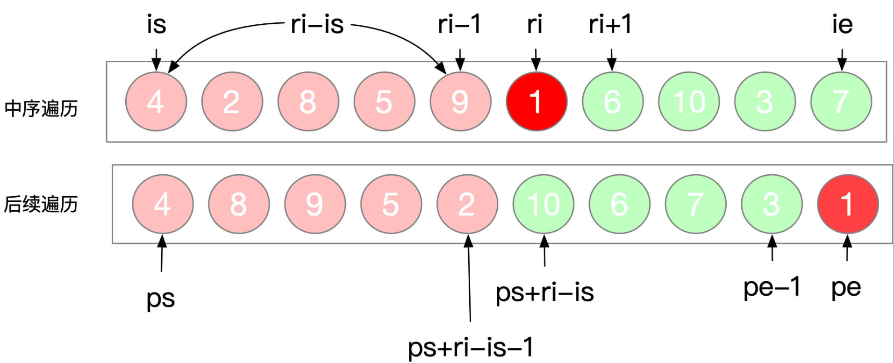

# 树

### 1、二叉树前序遍历

**描述：**给你二叉树的根节点 `root` ，返回它节点值的 **前序** 遍历。

```java
class Solution {
    public List<Integer> preorderTraversal(TreeNode root) {
        List<Integer> res = new ArrayList<Integer>();
        preorder(root, res);
        return res;
    }
    private void preorder(TreeNode node, List<Integer> list){
        if(node == null){
            return ;
        }
        list.add(node.val);
        preorder(node.left, list);
        preorder(node.right, list);
    }
}
```

---

### 2、二叉树中序遍历

**描述：**给定一个二叉树的根节点 `root` ，返回它的 **中序** 遍历。

```java
class Solution {
    public List<Integer> inorderTraversal(TreeNode root) {
        List<Integer> res = new ArrayList<Integer>();
        midorder(root, res);
        return res;
    }
    private void midorder(TreeNode node, List<Integer> list){
        if(node == null){
            return;
        }
        midorder(node.left, list);
        list.add(node.val);
        midorder(node.right, list);
    }
}
```

---

### 3、二叉树后续序遍历

描述：给定一个二叉树，返回它的 **后序** 遍历。

```java
class Solution {
    public List<Integer> postorderTraversal(TreeNode root) {
        List<Integer> res = new ArrayList<Integer>();
        lastorder(root, res);
        return res;
    }
    private void lastorder(TreeNode node, List<Integer> list){
        if(node == null){
            return ;
        }
        lastorder(node.left, list);
        lastorder(node.right, list);
        list.add(node.val);
    }
}
```

---

### 4、二叉树的层序遍历（广度优先）

**描述：**给你一个二叉树，请你返回其按 **层序遍历** 得到的节点值。 （即逐层地，从左到右访问所有节点）。

```java
class Solution {
    public List<List<Integer>> levelOrder(TreeNode root) {
        List<List<Integer>> res = new ArrayList<List<Integer>>();
        if(root == null) 
            return res;
        Queue<TreeNode> queue = new LinkedList<TreeNode>();
        queue.offer(root);
        while(!queue.isEmpty()){
            List<Integer> level = new ArrayList<Integer>();
            int currentLevelSize = queue.size();
            for(int i=0; i<currentLevelSize; i++){
                TreeNode node = queue.poll();
                level.add(node.val);
                if(node.left != null){
                    queue.offer(node.left);
                }
                if(node.right != null){
                    queue.offer(node.right);
                }
            }
            res.add(level);
        }
        return res;
    }
}
```

关键：==**队列**==

---

### 5、二叉树的最大深度

**描述：**给定一个二叉树，找出其最大深度。二叉树的深度为根节点到最远叶子节点的最长路径上的节点数。

```java
class Solution {
    public int maxDepth(TreeNode root) {
        if(root == null){
            return 0;
        }
        int m = maxDepth(root.left);
        int n = maxDepth(root.right);
        return Math.max(m,n)+1;
    }
}
```

**关键：**==**后序遍历**==、==**递归**== 

---

### 6、对称二叉树

**描述：**给定一个二叉树，检查它是否是镜像对称的。

```java
class Solution {
    public boolean isSymmetric(TreeNode root) {
        return check(root, root);
    }
    private boolean check(TreeNode p, TreeNode q){
        if(p == null && q == null){
            return true;
        }
        if(p==null || q==null){
            return false;
        }
        return q.val == p.val && check(p.right, q.left) && check(p.left, q.right);
    }
}
```

**关键：**==**深度优先搜索**==、==**广度优先搜索**== 

---

### 7、路径总和

给你二叉树的根节点 `root` 和一个表示目标和的整数 `targetSum` ，判断该树中是否存在 **根节点到叶子节点** 的路径，这条路径上所有节点值相加等于目标和 `targetSum` 。

```java
class Solution {
    public boolean hasPathSum(TreeNode root, int targetSum) {
        if(root == null){
            return false;
        }
        if(root.left == null && root.right == null){
            return targetSum == root.val;
        }
        return hasPathSum(root.left, targetSum-root.val) || hasPathSum(root.right, targetSum-root.val);
    }
}
```

**关键：**==**深度优先搜索**== 

---

### 8、从中序与后序遍历序列构造二叉树

**描述：**根据一棵树的中序遍历与后序遍历构造二叉树。



还原过程：


```java
class Solution {
    HashMap<Integer, Integer> memo = new HashMap<>();
    int[] post;
    public TreeNode buildTree(int[] inorder, int[] postorder) {
        for(int i=0; i < inorder.length ; ++i){
            memo.put(inorder[i], i);
        }
        post = postorder;
        TreeNode root = buildTree(0, inorder.length-1, 0, post.length-1);
        return root;
    }
    public TreeNode buildTree(int is, int ie, int ps, int pe){
        if(ie < is || pe < ps){
            return null;
        }

        int root = post[pe];
        int ri = memo.get(root);

        TreeNode node = new TreeNode(root);
        node.left = buildTree(is, ri-1, ps, ps+ri-is-1);
        node.right = buildTree(ri+1, ie, ps+ri-is, pe-1);
        return node;
    }
}
```

**关键：**==**深度优先搜索**== 

---

### 9、从前序与中序遍历序列构造二叉树

描述：根据一棵树的前序遍历与中序遍历构造二叉树。

```java
class Solution {
    HashMap<Integer, Integer> memo = new HashMap<>();
    int[] post;
    public TreeNode buildTree(int[] inorder, int[] postorder) {
        for(int i=0; i < inorder.length ; ++i){
            memo.put(inorder[i], i);
        }
        post = postorder;
        TreeNode root = buildTree(0, inorder.length-1, 0, post.length-1);
        return root;
    }
    public TreeNode buildTree(int is, int ie, int ps, int pe){
        if(ie < is || pe < ps){
            return null;
        }

        int root = post[pe];
        int ri = memo.get(root);

        TreeNode node = new TreeNode(root);
        node.left = buildTree(is, ri-1, ps, ps+ri-is-1);
        node.right = buildTree(ri+1, ie, ps+ri-is, pe-1);
        return node;
    }
}
```


**关键：**==**深度优先搜索**== 

---

### 10、填充每个节点的下一个右侧节点指针

给定一个 **完美二叉树** ，其所有叶子节点都在同一层，每个父节点都有两个子节点。二叉树定义如下：

> struct Node {
> 	int val;
> 	Node *left;
> 	Node *right;
> 	Node *next;
> }


填充它的每个 next 指针，让这个指针指向其下一个右侧节点。如果找不到下一个右侧节点，则将 next 指针设置为 NULL。

初始状态下，所有 next 指针都被设置为 NULL。


下面给出两种解法：

```java
// 法一：
class Solution {
    public Node connect(Node root) {
        //法1、广度优先搜索
        if(root == null){
            return null;
        }
        Queue<Node> queue = new LinkedList<Node>();
        queue.offer(root);
        while(!queue.isEmpty()){
            int currentLevelSize = queue.size();
            Node node = queue.peek();
            for(int i=0; i<currentLevelSize; ++i){
                node.next = queue.poll();
                node = node.next;
                if(i < currentLevelSize-1)
                    node.next = queue.peek();
                if(node.left != null)
                    queue.offer(node.left);
                if(node.right != null)
                    queue.offer(node.right);
            }
            node.next = null;
        }
        return root;
    }
}
```

```java
// 法二：
class Solution {
    public Node connect(Node root) {
        //法2、递归思想
        if(root == null){
            return null;
        }
        connectTwoNode(root.left, root.right);
        return  root;
    }
    
	public void connectTwoNode(Node node1, Node node2){
        if (node1 == null || node2 == null) {
            return;
        }
        node1.next = node2;

        connectTwoNode(node1.left, node1.right);
        connectTwoNode(node2.left, node2.right);
        connectTwoNode(node1.right, node2.left);
    }
}
```


**关键：**==**深度优先搜索**== 

---

### 11、二叉树的最近公共祖先

**描述：**给定一个二叉树, 找到该树中两个指定节点的最近公共祖先。

如：


> 输入：root = [3,5,1,6,2,0,8,null,null,7,4], p = 5, q = 1
> 输出：3
>
> 输入：root = [3,5,1,6,2,0,8,null,null,7,4], p = 5, q = 4
> 输出：5

```java
class Solution {
    public TreeNode lowestCommonAncestor(TreeNode root, TreeNode p, TreeNode q) {
        if(root == null || root == p || root == q) 
            return root;

        TreeNode left = lowestCommonAncestor(root.left, p, q);
        TreeNode right = lowestCommonAncestor(root.right, p, q);
        
        if(left == null) 
            return right;
        if(right == null) 
            return left;

        return root;
    }
}
```

具体可参考：题解：(https://leetcode-cn.com/problems/lowest-common-ancestor-of-a-binary-tree/solution/236-er-cha-shu-de-zui-jin-gong-gong-zu-xian-hou-xu/) 看看PPT展示的过程。

---

### 12、求二叉树中最大路径和

**描述：** **路径** 被定义为一条从树中任意节点出发，沿父节点-子节点连接，达到任意节点的序列。同一个节点在一条路径序列中 **至多出现一次** 。该路径 **至少包含一个** 节点，且不一定经过根节点。

**路径和** 是路径中各节点值的总和。

给你一个二叉树的根节点 `root` ，返回其 **最大路径和** 。

```java
class Solution {
    int max = Integer.MIN_VALUE;
    public int maxPathSum(TreeNode root) {
        if (root == null) {
            return 0;
        }
        dfs(root);
        return max;
    }

    /**
     * 返回经过root的单边分支最大和， 即Math.max(root, root+left, root+right)
     * @param root
     * @return
     */
    public int dfs(TreeNode root) {
        if (root == null) {
            return 0;
        }
        //计算左边分支最大值，左边分支如果为负数还不如不选择
        int leftMax = Math.max(0, dfs(root.left));
        //计算右边分支最大值，右边分支如果为负数还不如不选择
        int rightMax = Math.max(0, dfs(root.right));
        //left->root->right 作为路径与已经计算过历史最大值做比较
        max = Math.max(max, root.val + leftMax + rightMax);
        // 返回经过root的单边最大分支给当前root的父节点计算使用
        return root.val + Math.max(leftMax, rightMax);
    }
}
```


