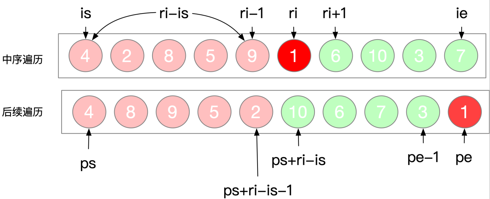
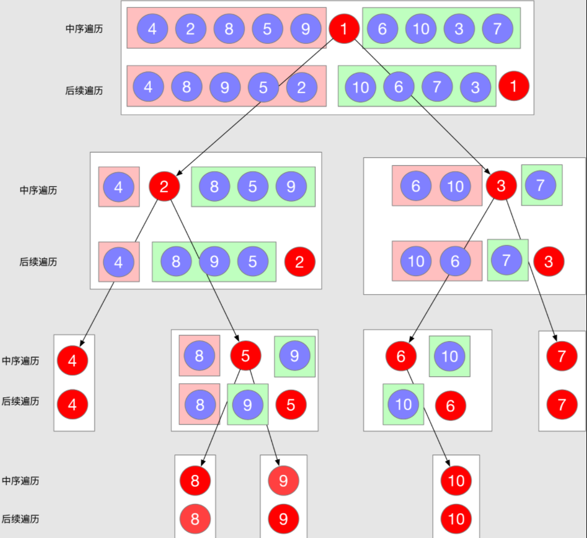
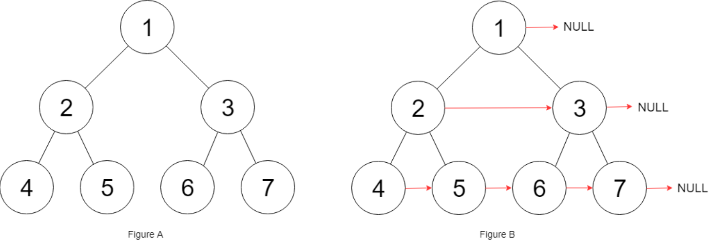

[TOC]


# 树

### 1、二叉树前序遍历

**描述：**给你二叉树的根节点 `root` ，返回它节点值的 **前序** 遍历。

```java
class Solution {
    public List<Integer> preorderTraversal(TreeNode root) {
        List<Integer> res = new ArrayList<Integer>();
        preorder(root, res);
        return res;
    }
    private void preorder(TreeNode node, List<Integer> list){
        if(node == null){
            return ;
        }
        list.add(node.val);
        preorder(node.left, list);
        preorder(node.right, list);
    }
}
```

---

### 2、二叉树中序遍历

**描述：**给定一个二叉树的根节点 `root` ，返回它的 **中序** 遍历。

```java
class Solution {
    public List<Integer> inorderTraversal(TreeNode root) {
        List<Integer> res = new ArrayList<Integer>();
        midorder(root, res);
        return res;
    }
    private void midorder(TreeNode node, List<Integer> list){
        if(node == null){
            return;
        }
        midorder(node.left, list);
        list.add(node.val);
        midorder(node.right, list);
    }
}
```

---

### 3、二叉树后续序遍历

描述：给定一个二叉树，返回它的 **后序** 遍历。

```java
class Solution {
    public List<Integer> postorderTraversal(TreeNode root) {
        List<Integer> res = new ArrayList<Integer>();
        lastorder(root, res);
        return res;
    }
    private void lastorder(TreeNode node, List<Integer> list){
        if(node == null){
            return ;
        }
        lastorder(node.left, list);
        lastorder(node.right, list);
        list.add(node.val);
    }
}
```

---

### 4、二叉树的层序遍历（广度优先）

**描述：**给你一个二叉树，请你返回其按 **层序遍历** 得到的节点值。 （即逐层地，从左到右访问所有节点）。

```java
class Solution {
    public List<List<Integer>> levelOrder(TreeNode root) {
        List<List<Integer>> res = new ArrayList<List<Integer>>();
        if(root == null) 
            return res;
        Queue<TreeNode> queue = new LinkedList<TreeNode>();
        queue.offer(root);
        while(!queue.isEmpty()){
            List<Integer> level = new ArrayList<Integer>();
            int currentLevelSize = queue.size();
            for(int i=0; i<currentLevelSize; i++){
                TreeNode node = queue.poll();
                level.add(node.val);
                if(node.left != null){
                    queue.offer(node.left);
                }
                if(node.right != null){
                    queue.offer(node.right);
                }
            }
            res.add(level);
        }
        return res;
    }
}
```

关键：==**队列**==

---

### 5、二叉树的最大深度

**描述：**给定一个二叉树，找出其最大深度。二叉树的深度为根节点到最远叶子节点的最长路径上的节点数。

```java
class Solution {
    public int maxDepth(TreeNode root) {
        if(root == null){
            return 0;
        }
        int m = maxDepth(root.left);
        int n = maxDepth(root.right);
        return Math.max(m,n)+1;
    }
}
```

**关键：**==**后序遍历**==、==**递归**== 

---

### 6、对称二叉树

**描述：**给定一个二叉树，检查它是否是镜像对称的。

```java
class Solution {
    public boolean isSymmetric(TreeNode root) {
        return check(root, root);
    }
    private boolean check(TreeNode p, TreeNode q){
        if(p == null && q == null){
            return true;
        }
        if(p==null || q==null){
            return false;
        }
        return q.val == p.val && check(p.right, q.left) && check(p.left, q.right);
    }
}
```

**关键：**==**深度优先搜索**==、==**广度优先搜索**== 

---

### 7、路径总和

给你二叉树的根节点 `root` 和一个表示目标和的整数 `targetSum` ，判断该树中是否存在 **根节点到叶子节点** 的路径，这条路径上所有节点值相加等于目标和 `targetSum` 。

```java
class Solution {
    public boolean hasPathSum(TreeNode root, int targetSum) {
        if(root == null){
            return false;
        }
        if(root.left == null && root.right == null){
            return targetSum == root.val;
        }
        return hasPathSum(root.left, targetSum-root.val) || hasPathSum(root.right, targetSum-root.val);
    }
}
```

**关键：**==**深度优先搜索**== 

---

### 8、从中序与后序遍历序列构造二叉树

**描述：**根据一棵树的中序遍历与后序遍历构造二叉树。



还原过程：



```java
class Solution {
    HashMap<Integer, Integer> memo = new HashMap<>();
    int[] post;
    public TreeNode buildTree(int[] inorder, int[] postorder) {
        for(int i=0; i < inorder.length ; ++i){
            memo.put(inorder[i], i);
        }
        post = postorder;
        TreeNode root = buildTree(0, inorder.length-1, 0, post.length-1);
        return root;
    }
    public TreeNode buildTree(int is, int ie, int ps, int pe){
        if(ie < is || pe < ps){
            return null;
        }

        int root = post[pe];
        int ri = memo.get(root);

        TreeNode node = new TreeNode(root);
        node.left = buildTree(is, ri-1, ps, ps+ri-is-1);
        node.right = buildTree(ri+1, ie, ps+ri-is, pe-1);
        return node;
    }
}
```

**关键：**==**深度优先搜索**== 

---

### 9、从前序与中序遍历序列构造二叉树

描述：根据一棵树的前序遍历与中序遍历构造二叉树。

```java
class Solution {
    HashMap<Integer, Integer> memo = new HashMap<>();
    int[] post;
    public TreeNode buildTree(int[] inorder, int[] postorder) {
        for(int i=0; i < inorder.length ; ++i){
            memo.put(inorder[i], i);
        }
        post = postorder;
        TreeNode root = buildTree(0, inorder.length-1, 0, post.length-1);
        return root;
    }
    public TreeNode buildTree(int is, int ie, int ps, int pe){
        if(ie < is || pe < ps){
            return null;
        }

        int root = post[pe];
        int ri = memo.get(root);

        TreeNode node = new TreeNode(root);
        node.left = buildTree(is, ri-1, ps, ps+ri-is-1);
        node.right = buildTree(ri+1, ie, ps+ri-is, pe-1);
        return node;
    }
}
```


**关键：**==**深度优先搜索**== 

---

### 10、填充每个节点的下一个右侧节点指针

给定一个 **完美二叉树** ，其所有叶子节点都在同一层，每个父节点都有两个子节点。二叉树定义如下：

> struct Node {
>   	int val;
>   	Node *left;
>   	Node *right;
>   	Node *next;
> }


填充它的每个 next 指针，让这个指针指向其下一个右侧节点。如果找不到下一个右侧节点，则将 next 指针设置为 NULL。

初始状态下，所有 next 指针都被设置为 NULL。



下面给出两种解法：

```java
// 法一：
class Solution {
    public Node connect(Node root) {
        //法1、广度优先搜索
        if(root == null){
            return null;
        }
        Queue<Node> queue = new LinkedList<Node>();
        queue.offer(root);
        while(!queue.isEmpty()){
            int currentLevelSize = queue.size();
            Node node = queue.peek();
            for(int i=0; i<currentLevelSize; ++i){
                node.next = queue.poll();
                node = node.next;
                if(i < currentLevelSize-1)
                    node.next = queue.peek();
                if(node.left != null)
                    queue.offer(node.left);
                if(node.right != null)
                    queue.offer(node.right);
            }
            node.next = null;
        }
        return root;
    }
}
```

```java
// 法二：
class Solution {
    public Node connect(Node root) {
        //法2、递归思想
        if(root == null){
            return null;
        }
        connectTwoNode(root.left, root.right);
        return  root;
    }
    
	public void connectTwoNode(Node node1, Node node2){
        if (node1 == null || node2 == null) {
            return;
        }
        node1.next = node2;

        connectTwoNode(node1.left, node1.right);
        connectTwoNode(node2.left, node2.right);
        connectTwoNode(node1.right, node2.left);
    }
}
```


**关键：**==**深度优先搜索**== 

---

### 11、二叉树的最近公共祖先

**描述：**给定一个二叉树, 找到该树中两个指定节点的最近公共祖先。

如：


> 输入：root = [3,5,1,6,2,0,8,null,null,7,4], p = 5, q = 1
> 输出：3
>
> 输入：root = [3,5,1,6,2,0,8,null,null,7,4], p = 5, q = 4
> 输出：5

```java
class Solution {
    public TreeNode lowestCommonAncestor(TreeNode root, TreeNode p, TreeNode q) {
        if(root == null || root == p || root == q) 
            return root;

        TreeNode left = lowestCommonAncestor(root.left, p, q);
        TreeNode right = lowestCommonAncestor(root.right, p, q);
        
        if(left == null) 
            return right;
        if(right == null) 
            return left;

        return root;
    }
}
```

具体可参考：题解：(https://leetcode-cn.com/problems/lowest-common-ancestor-of-a-binary-tree/solution/236-er-cha-shu-de-zui-jin-gong-gong-zu-xian-hou-xu/) 看看PPT展示的过程。

---

### 12、求二叉树中最大路径和

**描述：** **路径** 被定义为一条从树中任意节点出发，沿父节点-子节点连接，达到任意节点的序列。同一个节点在一条路径序列中 **至多出现一次** 。该路径 **至少包含一个** 节点，且不一定经过根节点。

**路径和** 是路径中各节点值的总和。

给你一个二叉树的根节点 `root` ，返回其 **最大路径和** 。

```java
class Solution {
    int max = Integer.MIN_VALUE;
    public int maxPathSum(TreeNode root) {
        if (root == null) {
            return 0;
        }
        dfs(root);
        return max;
    }

    /**
     * 返回经过root的单边分支最大和， 即Math.max(root, root+left, root+right)
     * @param root
     * @return
     */
    public int dfs(TreeNode root) {
        if (root == null) {
            return 0;
        }
        //计算左边分支最大值，左边分支如果为负数还不如不选择
        int leftMax = Math.max(0, dfs(root.left));
        //计算右边分支最大值，右边分支如果为负数还不如不选择
        int rightMax = Math.max(0, dfs(root.right));
        //left->root->right 作为路径与已经计算过历史最大值做比较
        max = Math.max(max, root.val + leftMax + rightMax);
        // 返回经过root的单边最大分支给当前root的父节点计算使用
        return root.val + Math.max(leftMax, rightMax);
    }
}
```


------

# 动态规划

### 1、斐波那契数列

写一个函数，输入 `n` ，求斐波那契（Fibonacci）数列的第 `n` 项（即 `F(N)`）。斐波那契数列的定义如下：

> F(0) = 0,   F(1) = 1
> F(N) = F(N - 1) + F(N - 2), 其中 N > 1.

斐波那契数列由 0 和 1 开始，之后的斐波那契数就是由之前的两数相加而得出。

```java
public class Solution {
    public int Fibonacci(int n) {
        if(n == 0) return 0;
        int pre = 0;
        int cur = 1;
        for(int i=1; i<n; i++){
            int sum = cur + pre;
            pre = cur;
            cur = sum;
        }
        return cur;
    }
}
```

---

### 2、零钱兑换

给定不同面额的硬币 `coins` 和一个总金额 `amount`。编写一个函数来计算可以凑成总金额所需的最少的硬币个数。如果没有任何一种硬币组合能组成总金额，返回 `-1`。


# 牛客高频200

### N_78 反转链表

**描述：**输入一个链表，反转链表后，输出新链表的表头。

```java
public class Solution {
    public ListNode ReverseList(ListNode head) {
        if(head == null || head.next == null){
            return head;
        }
//         ListNode p = head;
//         ListNode q = head.next;
//         p.next = null;
//         ListNode temp = null;
//         while(q != null){
//             temp = q.next;
//             q.next = p;
//             p = q;
//             q = temp;
//         }
//         return p;
//         1、迭代法
//         ListNode pre = head;
//         ListNode curr = head.next;
//         pre.next = null;
//         while(curr != null){
//             ListNode temp = curr.next;
//             curr.next = pre;
//             pre = curr;
//             curr = temp;
//         }
//         return pre;
        // 2、递归法
        ListNode newHead = ReverseList(head.next);
        head.next.next = head;
        head.next = null;
        return newHead;
    }
}
```


### N_140 快速排序

**描述：**给定一个数组，请你编写一个函数，返回该数组排序后的形式。

```java
public class Solution {
    /**
     * 代码中的类名、方法名、参数名已经指定，请勿修改，直接返回方法规定的值即可
     * 将给定数组排序
     * @param arr int整型一维数组 待排序的数组
     * @return int整型一维数组
     */
    public int[] MySort (int[] arr) {
        // write code here
        quick(arr, 0, arr.length-1);
        return arr;
    }
    public void quick(int[] list, int left, int right){
        if(left<right){
            int point = partition(list, left, right);
            quick(list, left, point-1);
            quick(list, point+1, right);
        }
    }
    private int partition(int[] list, int left, int right){
        int temp = list[right];
        int point = left-1;
        for(int i=left; i<right; i++){
            if(list[i]<temp){
                point ++;
                swap(list, point, i);
            }
        }
        swap(list, point+1, right);
        return point + 1;
    }
    private void swap(int[] list, int i, int j){
        int temp = list[i];
        list[i] = list[j];
        list[j] = temp;
    }
}
```


---

### N_93 设计缓存结构

**描述：**设计LRU缓存结构，该结构在构造时确定大小，假设大小为K，并有如下两个功能

- set(key, value)：将记录(key, value)插入该结构
- get(key)：返回key对应的value值

[要求]

1. set和get方法的时间复杂度为O(1)
2. 某个key的set或get操作一旦发生，认为这个key的记录成了最常使用的。
3. 当缓存的大小超过K时，移除最不经常使用的记录，即set或get最久远的。

若opt=1，接下来两个整数x, y，表示set(x, y)
若opt=2，接下来一个整数x，表示get(x)，若x未出现过或已被移除，则返回-1
对于每个操作2，输出一个答案

```java
public class Solution {
    /**
     * 对应力扣：P146题
     * lru design
     * @param operators int整型二维数组 the ops
     * @param k int整型 the k
     * @return int整型一维数组
     */
    class DLinkedNode{
        int key;
        int value;
        DLinkedNode pre, next;
        DLinkedNode(){}
        DLinkedNode(int _key, int _value){key=_key; value=_value;}
    }
    private int k;
    private int size;
    private DLinkedNode head = new DLinkedNode(-1, -1);
    private DLinkedNode tail = new DLinkedNode(-1, -1);
    
    private Map<Integer, DLinkedNode> cache = new HashMap<Integer, DLinkedNode>();
    
    public int[] LRU (int[][] operators, int k) {
        // write code here
        this.size = 0;
        this.k = k;
        head.next = tail;
        tail.pre = head;
        int len = (int)Arrays.stream(operators).filter(x -> x[0]==2).count();
        int[] res = new int[len];
        for(int i=0, j=0; i<operators.length; i++){
            if(operators[i][0]==1){
                set(operators[i][1], operators[i][2]);
            }else{
                res[j++] = get(operators[i][1]);
            }
        }
        return res;
    }
    private void set(int key, int value){
        DLinkedNode node = cache.get(key);
        if(node==null){
            DLinkedNode newNode = new DLinkedNode(key, value);
            cache.put(key,newNode);
            addToHead(newNode);
            size++;
            if(size>k){
                DLinkedNode tailNode = removeTail();
                cache.remove(tailNode.key);
                size--;
            }
        }else{
            node.value = value;
            moveToHead(node);
        }
    }
    private int get(int key){
        DLinkedNode node = cache.get(key);
        if(node==null){
            return -1;
        }
        moveToHead(node);
        return node.value;
    }
    private void addToHead(DLinkedNode node){
        node.next = head.next;
        node.pre = head;
        head.next.pre = node;
        head.next = node;
    }
    private void removeNode(DLinkedNode node){
        node.next.pre = node.pre;
        node.pre.next = node.next;
    }
    private void moveToHead(DLinkedNode node){
        // 顺序不能反！！！！！
        removeNode(node);
        addToHead(node);
    }
    private DLinkedNode removeTail(){
        DLinkedNode node = tail.pre;
        removeNode(node);
        return node;
    }
}
```


---

### N_45 实现二叉树先序、中序、后序遍历

**描述：**分别按照二叉树先序，中序和后序打印所有的节点。

```java
public class Solution {
    /**
     * 
     * @param root TreeNode类 the root of binary tree
     * @return int整型二维数组
     */
    
    public int[][] threeOrders (TreeNode root) {
        // write code here
        List<Integer> pre = new ArrayList<Integer>();
        List<Integer> mid = new ArrayList<Integer>();
        List<Integer> last = new ArrayList<Integer>();
        preorder(root, pre);
        midorder(root, mid);
        lastorder(root, last);
        int[][] orders = new int[3][pre.size()];
        orders[0] = toIntArray(pre);
        orders[1] = toIntArray(mid);
        orders[2] = toIntArray(last);
        return orders;
        
    }
    private int[] toIntArray(List<Integer> list){
        int[] temp = new int[list.size()];
        for(int i=0; i<list.size(); i++){
            temp[i] = list.get(i);
        }
        return temp;
    }
    private void preorder(TreeNode root, List<Integer> pre){
        if(root==null){
            return;
        }
        pre.add(root.val);
        preorder(root.left, pre);
        preorder(root.right, pre);
    }
    private void midorder(TreeNode root, List<Integer> mid){
        if(root==null){
            return;
        }
        midorder(root.left, mid);
        mid.add(root.val);
        midorder(root.right, mid);
    }
    private void lastorder(TreeNode root, List<Integer> last){
        if(root==null){
            return;
        }
        lastorder(root.left, last);
        lastorder(root.right, last);
        last.add(root.val);
    }
}
```


---

### N_119 最小的K个数

**描述：**给定一个数组，找出其中最小的K个数。例如数组元素是4,5,1,6,2,7,3,8这8个数字，则最小的4个数字是1,2,3,4。如果K>数组的长度，那么返回一个空的数组

```java
public class Solution {
    public ArrayList<Integer> GetLeastNumbers_Solution(int [] input, int k) {
//         先进行快排
        ArrayList<Integer> res = new ArrayList<>();
        if(k<=0 || k>input.length){
            return res;
        }
        
        quick_sort(input, 0, input.length-1, k);
        
        for(int i=0; i<k; i++){
            res.add(input[i]);
        }
        return res;
        
    }
    private void quick_sort(int[] list, int left, int right, int k){
        if(left <= right){
            int position = pertation(list, left, right);
            if(k <= position+1){
                quick_sort(list, left, position-1, k);
            }else{
                quick_sort(list, position+1, right, k);
            }
        }
    }
    
    private int pertation(int[] list, int left, int right){
        int base = list[right];
        int position = left - 1;
        for(int i=left; i<right; i++){
            if(list[i]<base){
                position ++;
                swap(list, position, i);
            }
        }
        swap(list, position+1, right);
        return position+1;
    }
    
    private void swap(int[] list, int i, int j){
        int temp = list[i];
        list[i] = list[j];
        list[j] = temp;
    }
}
```


---

### N_15 二叉树的层序遍历

**描述：**给定一个二叉树，返回该二叉树层序遍历的结果，（从左到右，一层一层地遍历）

```java
public class Solution {
    /**
     * 
     * @param root TreeNode类 
     * @return int整型ArrayList<ArrayList<>>
     */
    public ArrayList<ArrayList<Integer>> levelOrder (TreeNode root) {
        // write code here
        ArrayList<ArrayList<Integer>> res = new ArrayList<ArrayList<Integer>>();
        if(root==null){
            return res;
        }
        
        Queue<TreeNode> queue = new LinkedList<TreeNode>();
        queue.offer(root);
        while(!queue.isEmpty()){
            int currentLevelSize = queue.size();
            ArrayList<Integer> level = new ArrayList<Integer>();
            for(int i=0; i<currentLevelSize; i++){
                TreeNode node = queue.poll();
                level.add(node.val);
                if(node.left != null){
                    queue.offer(node.left);
                }
                if(node.right != null){
                    queue.offer(node.right);
                }
            }
            res.add(level);
        }
        return res;
    }
}
```


---

### N_88 寻找第K大数

**描述：**有一个整数数组，请你根据快速排序的思路，找出数组中第K大的数。

给定一个整数数组a,同时给定它的大小n和要找的K(K在1到n之间)，请返回第K大的数，保证答案存在。

```java
public class Solution {
    public int findKth(int[] a, int n, int K) {
        // write code here
        int res = quick_sort(a, 0, n-1, K);
        return res;
    }
    private int quick_sort(int[] list, int left, int right, int K){
        if(left<=right){
            int position = pratition(list, left, right);
            if(K == position+1){
                return list[position];
            }else if(K < position+1){
                return quick_sort(list, left, position-1, K);
            }
            else{
                return quick_sort(list, position+1, right, K);
            }
        }
        return -1;
    }
    private int pratition(int[] list, int left, int right){
        int base = list[right];
        int pos = left - 1;
        for(int i=left; i<right; i++){
            if(base<list[i]){
                pos ++;
                swap(list, pos, i);
            }
        }
        swap(list, pos+1, right);
        return pos+1;
    }
    private void swap(int[] list, int i, int j){
        int temp = list[i];
        list[i] = list[j];
        list[j] = temp;
    }
}
```


---

### N_61 两数之和

**描述：**给出一个整数数组，请在数组中找出两个加起来等于目标值的数，

你给出的函数 `twoSum` 需要返回这两个数字的下标（`index1`，`index2`），需要满足 `index1` 小于 `index2`。注意：下标是从1开始的

假设给出的数组中只存在唯一解

例如：

给出的数组为 `{20, 70, 110, 150}`,目标值为`90` 
输出 `index1=1, index2=2`

```java
public class Solution {
    /**
     * 
     * @param numbers int整型一维数组 
     * @param target int整型 
     * @return int整型一维数组
     */
    public int[] twoSum (int[] numbers, int target) {
        // write code here
//         int[] res = {0, 0};
//         HashMap<Integer, Integer> mp = new HashMap<Integer, Integer>();
//         for(int i=0; i<numbers.length; i++){
//             mp.put(numbers[i], i);
//         }
        
//         for(int i = 0; i<numbers.length; i++){
//             if(mp.containsKey(target - numbers[i]) && i!=mp.get(target-numbers[i])){
//                 res[0] = i+1;
//                 res[1] = mp.get(target - numbers[i])+1;
//                 return res;
//             }
//         }
//         return res;
        
        HashMap<Integer, Integer> mp = new HashMap<Integer, Integer>();
        for(int cur=0,temp; cur<numbers.length; cur++){
            if(mp.containsKey(target-numbers[cur])){
                return new int[] {mp.get(target-numbers[cur])+1, cur+1};
            }
            mp.put(numbers[cur], cur);
        }
        throw new RuntimeException("results not exits");
    }
}
```


---

### N_33 合并有序链表

**描述：**将两个有序的链表合并为一个新链表，要求新的链表是通过拼接两个链表的节点来生成的，且合并后新链表依然有序。

```java
public class Solution {
    /**
     * 
     * @param l1 ListNode类 
     * @param l2 ListNode类 
     * @return ListNode类
     */
    public ListNode mergeTwoLists (ListNode l1, ListNode l2) {
        // write code here
        if(l1 == null) return l2;
        if(l2 == null) return l1;
        ListNode head = new ListNode(0);
        ListNode temp = head;
        
        while(l1 != null && l2 != null){
            if(l1.val <= l2.val){
                temp.next = l1;
                l1 = l1.next;
            }else{
                temp.next = l2;
                l2 = l2.next;
            }
            temp = temp.next;
        }
        temp.next = (l1==null) ? l2 : l1;
        return head.next;
    }
}
```


---

### N_76 用两个栈实现队列

**描述：**用两个栈来实现一个队列，完成队列的Push和Pop操作。 队列中的元素为int类型。

```java
public class Solution {
    Stack<Integer> stack1 = new Stack<Integer>();
    Stack<Integer> stack2 = new Stack<Integer>();
    
    public void push(int node) {
        stack1.push(node);
    }
    
    public int pop() {
        if(stack2.size() <= 0){
            while(stack1.size() != 0){
                stack2.push(stack1.pop());
            }
        }
        return stack2.pop();
    }
}
```


---

### N_68 跳台阶

描述：一只青蛙一次可以跳上1级台阶，也可以跳上2级。求该青蛙跳上一个n级的台阶总共有多少种跳法（先后次序不同算不同的结果）。

```java
public class Solution {
    public int jumpFloor(int target) {
        // 法1：自上向底型递归求解
//         if (target == 1) return 1;
//         if (target == 2) return 2;
//         return jumpFloor(target - 1) + jumpFloor(target - 2);
        
        // 法2：自底向上型循环求解
        int a = 1, b = 1;
        for (int i = 2; i <= target; i++) {
            // 求f[i] = f[i - 1] + f[i - 2]
            a = a + b; // 这里求得的 f[i] 可以用于下次循环求 f[i+1]
            // f[i - 1] = f[i] - f[i - 2]
            b = a - b; // 这里求得的 f[i-1] 可以用于下次循环求 f[i+1]
        }
        return a;
    }
}
```


---

### N_50 链表中的节点每k个一组翻转

**描述：**将给出的链表中的节点每 *k* 个一组翻转，返回翻转后的链表
如果链表中的节点数不是 *k* 的倍数，将最后剩下的节点保持原样
你不能更改节点中的值，只能更改节点本身。
要求空间复杂度 *O(1)* 

例如：

给定的链表是1→2→3→4→5

对于 *k*=2, 你应该返回 2→1→4→3→5

对于 *k*=3, 你应该返回 3→2→1→4→5

```java
public class Solution {
    /**
     * 
     * @param head ListNode类 
     * @param k int整型 
     * @return ListNode类
     */
    public ListNode reverseKGroup (ListNode head, int k) {
        // write code here
        ListNode hair = new ListNode(-1);
        hair.next = head;
        ListNode pre = hair;
        
        while(head != null){
            ListNode tail = pre;
            for(int i=0; i<k; i++){
                tail = tail.next;
                if(tail == null){
                    return hair.next;
                }
            }
            
            ListNode nex = tail.next;
            ListNode[] reverse = myReverse(head, tail);
            head = reverse[0];
            tail = reverse[1];
            
            pre.next = head;
            tail.next = nex;
            pre = tail;
            head = tail.next;
        }
        return hair.next;
    }
    
    public ListNode[] myReverse(ListNode head, ListNode tail){
        ListNode pre = tail.next;
        ListNode p = head;
        while(pre != tail){
            ListNode nex = p.next;
            p.next = pre;
            pre = p;
            p = nex;
        }
        return new ListNode[]{tail, head};
    }
}
```


---

### N_19 子数组的最大累加和问题

描述：给定一个数组`arr`，返回`子数组`的**最大累加和**

例如，`arr = [1, -2, 3, 5, -2, 6, -1]`，所有子数组中，`[3, 5, -2, 6]`可以累加出最大的和`12`，所以返回`12`.

题目保证没有全为负数的数据

[要求]

时间复杂度为*O*(*n*)，空间复杂度为*O (1)* 

```java
public class Solution {
    /**
     * max sum of the subarray
     * @param arr int整型一维数组 the array
     * @return int整型
     */
    public int maxsumofSubarray (int[] arr) {
        // write code here
        int res = arr[0];
        for(int i=1; i<arr.length; i++){
            arr[i] += arr[i-1] > 0? arr[i-1]:0;
            res = res>arr[i]? res:arr[i];
        }
        return res;
    }
}
```


---

### N_41 最长无重复子串

描述：给定一个数组arr，返回arr的最长无的重复子串的长度(无重复指的是所有数字都不相同)。

```java
public class Solution {
    /**
     * 
     * @param arr int整型一维数组 the array
     * @return int整型
     */
    public int maxLength (int[] arr) {
        // write code here
        HashMap<Integer, Integer> hm = new HashMap<>();
        int maxLen = 0;
        int start = 0;
        for(int i=0; i<arr.length; i++){
            if(hm.containsKey(arr[i])){
                start = Math.max(start, hm.get(arr[i])+1);
            }
            maxLen = Math.max(maxLen, i-start+1);
            hm.put(arr[i], i);
        }
        return maxLen;
        
    }
}
```


---

### N_4 判断链表中是否有环

描述：判断给定的链表中是否有环。如果有环则返回`true`，否则返回`false`。

你能给出空间复杂度*O (1)* 的解法么？

```java
public class Solution {
    public boolean hasCycle(ListNode head) {
        if(head==null || head.next==null){
            return false;
        }
        ListNode slow = head, fast = head.next;
        while(slow != fast){
            if(fast == null || fast.next == null){
                return false;
            }
            slow = slow.next;
            fast = fast.next.next;
        }
        return true;
    }
}
```


---

### N_22 合并两个有序的数组

描述：给出两个有序的整数数组  和，请将数组合并到数组 中，变成一个有序的数组
注意：
可以假设 数组有足够的空间存放 数组的元素， 和 中初始的元素数目分别为 和 

```java
public class Solution {
    // 力扣：P88
    public void merge(int A[], int m, int B[], int n) {
        int i=m-1, j=n-1;
        for(int t=m+n-1; j>=0; t--){
            if(i<0){
                A[t] = B[j--];
            }
            else if(A[i]>B[j]){
                A[t] = A[i--];
            }else{
                A[t] = B[j--];
            }
        }
    }
}
```

